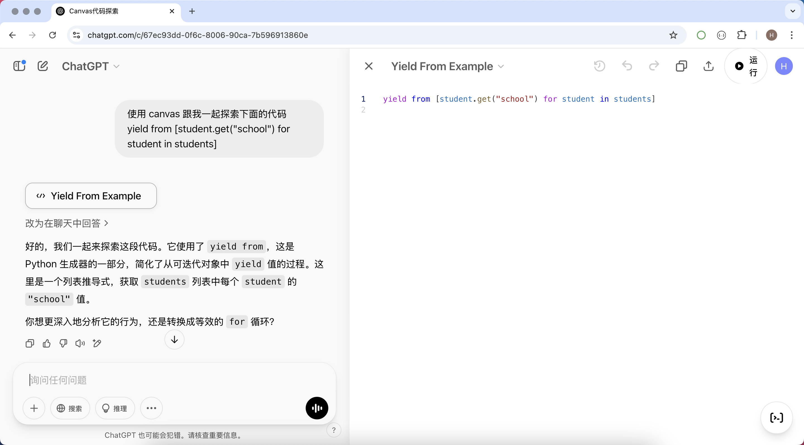
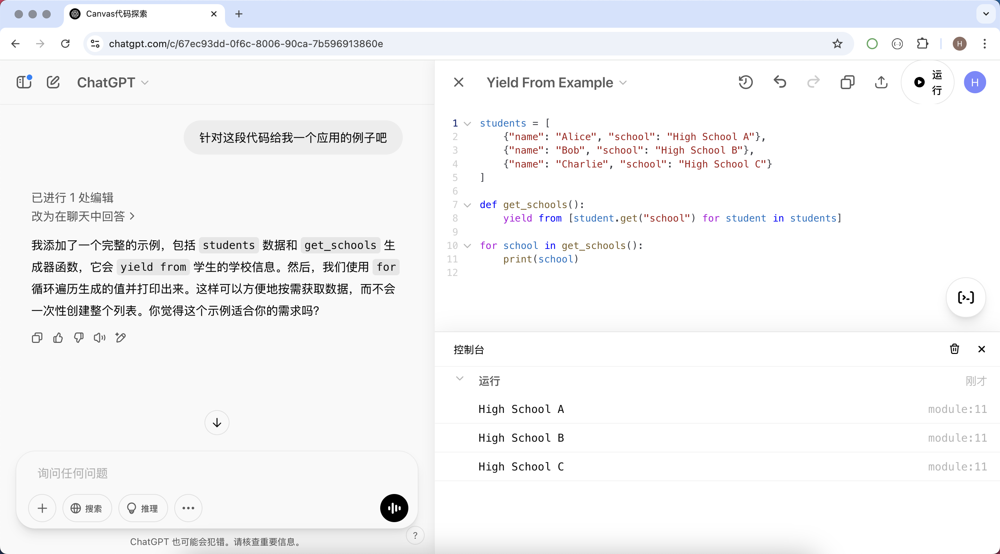
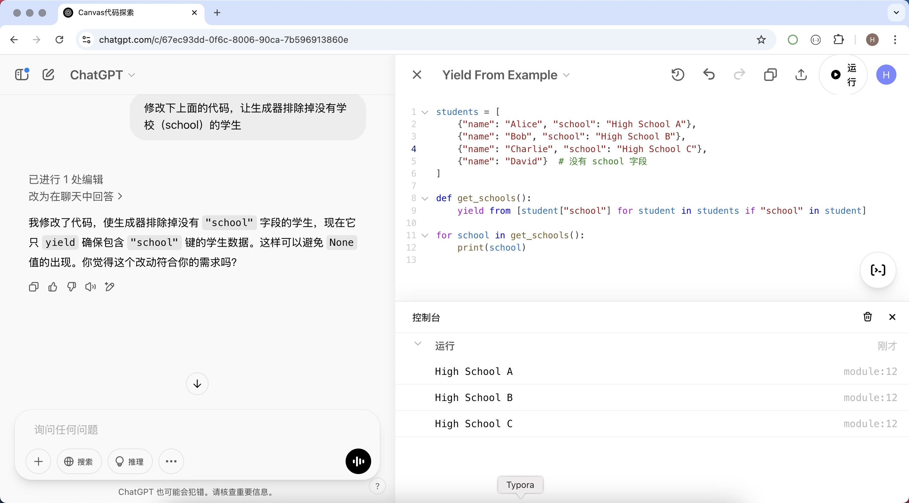
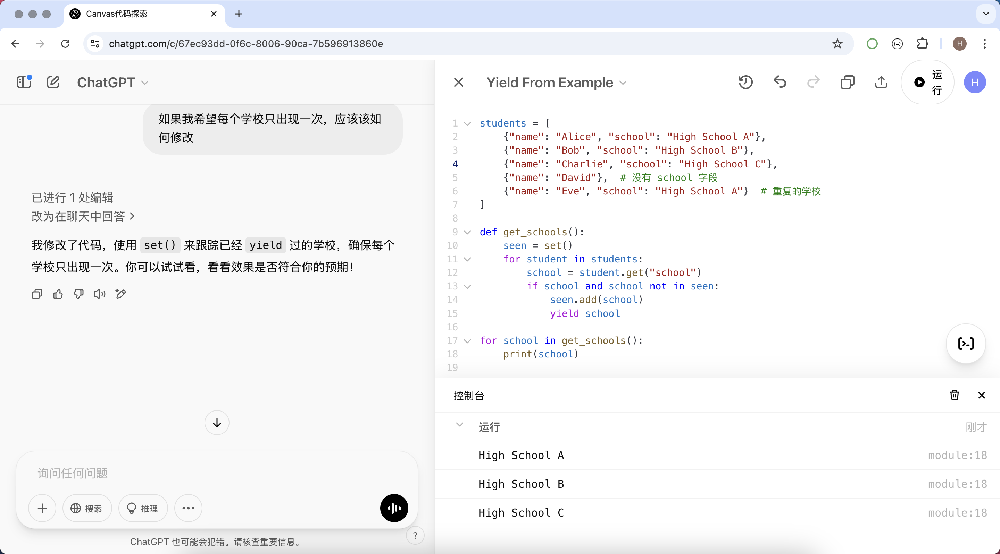
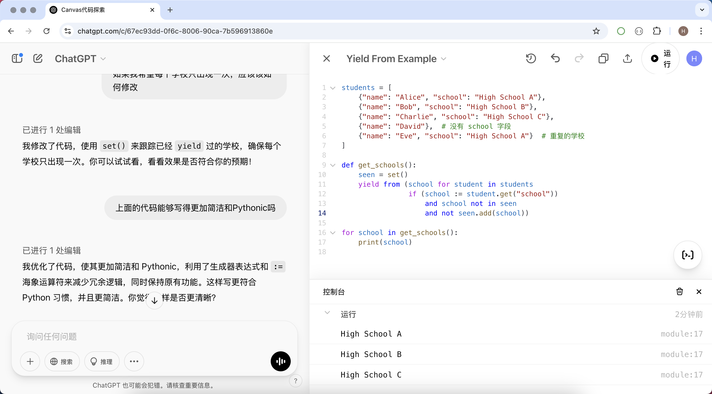

## 用Canvas学习编程

在学习编程的过程中，我们经常需要编写、修改和优化代码。而 ChatGPT 的 Canvas 功能提供了一种高效、直观的方式来帮助我们更好地理解和提升代码能力。下面，我们就简单介绍一下如何利用 ChatGPT 的 Canvas 功能来学习和理解代码。

### Canvas使用场景

#### 1. 代码实时编辑与优化

Canvas 功能可以作为一个交互式代码编辑器，允许我们直接在其中编写代码，并实时修改和优化。当我们遇到代码问题时，可以在 Canvas 中提交代码，并请求 ChatGPT 提供优化建议。例如：

- 通过 ChatGPT 进行代码重构，使代码更简洁、易读。
- 让 ChatGPT 解释某段代码的逻辑，帮助理解复杂算法或设计模式。
- 在 Canvas 中迭代改进代码，提高运行效率或减少冗余代码。

#### 2. 学习编程概念与示例

对于初学者来说，Canvas 也是一个很好的学习工具。你可以在 Canvas 中输入示例代码，并让 ChatGPT 解释其作用。例如：

- 学习基础语法，例如变量、循环、函数等。
- 通过示例代码学习数据结构和算法，如链表、排序算法等。
- 让 ChatGPT 提供代码示例，并逐行解释代码的运行方式。

#### 3. 代码调试与错误修正

在编程过程中，错误是不可避免的。Canvas 可以帮助快速定位和修复错误。

- 将错误代码粘贴到 Canvas，让 ChatGPT 分析错误原因。
- 让 ChatGPT 提供修正方案，并解释错误发生的原因。
- 通过 Canvas 进行多次调试，逐步优化代码逻辑。

#### 4. 代码注释与文档生成

编写清晰的注释和文档对于代码的可读性至关重要。Canvas 可以帮助我们快速生成代码注释和文档：

- 让 ChatGPT 为代码添加详细注释，方便后续维护和理解。
- 自动生成 API 文档，方便团队协作。
- 生成代码执行流程的简要说明，帮助快速掌握代码逻辑。

### Canvas应用举例

```python
yield from [student.get("school") for student in students]
```

在学习的 Python 语言的时候，假如你看到上面这段代码但并不理解它的意图，你可以使用如下所示的提示词跟 ChatGPT 开启对话，你甚至不用告诉它你用的什么编程语言，也不用交待这段代码的上下文。

```
使用 canvas 跟我一起探索下面的代码
yield from [student.get("school") for student in students]
```

如下图所示，ChatGPT 给出了关于上面代码的回复，右侧展开了 Canvas 并将我们的代码置于其中。



如果上面的回答还是没能帮你理解这段代码，我们可以让 ChatGPT 给出对应的例子，提示词如下。

```
针对这段代码给我一个应用的例子吧
```

如下图所示，ChatGPT 已经帮我修改了 Canvas 中的代码，给出了一段完整的可运行的 Python 代码，我们可以点击 Canvas 上面的运行按钮来执行这段代码，Canvas 目前已经可以支持很多种编程语言，你熟悉的编程语言它应该也是熟悉的。



如果你理解了上面的操作，我们还可以继续提出疑问，如果`"school"`字段不存在，我们的代码改如何修改。

```
修改下上面的代码，让生成器排除掉没有学校（school）的学生
```



然后，我们再进一步根据我们实际的需要，让 ChatGPT 帮助我们修改代码。

```
如果我希望每个学校只出现一次，应该该如何修改
```



对于写 Python 的人来说，如果你认为 ChatGPT 生成的代码不够简洁、不够 Pythonic，我们可以继续提问。

```
上面的代码能够写得更加简洁和Pythonic吗
```



### 总结

ChatGPT 的 Canvas 功能不仅仅是一个代码编辑器，更是一个智能的编程助手。无论你是编程初学者，还是经验丰富的开发者，都可以通过 Canvas 提高代码理解和编写能力。通过不断实践和探索，你可以更高效地掌握编程技巧，并提升自身的技术水平。